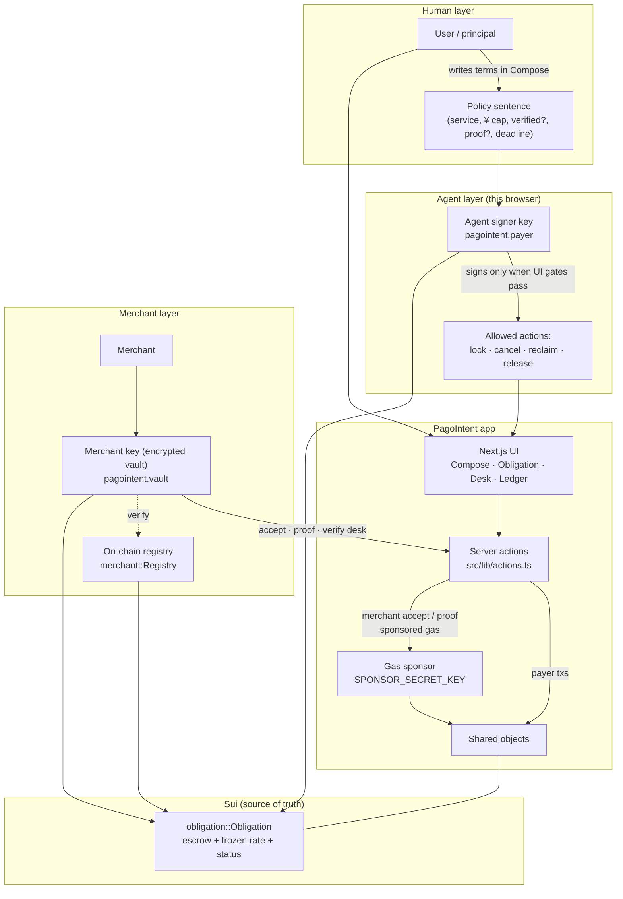
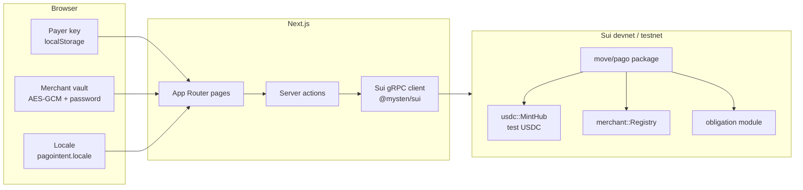
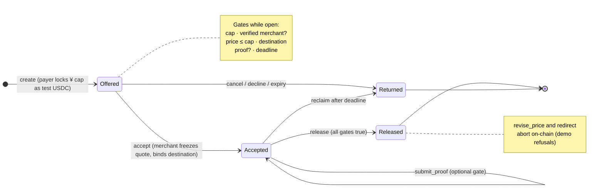

<p>
  
</p>

# PagoIntent

A programmable obligation layer for agentic commerce on Sui. PagoIntent decides what must be true before an autonomous agent is allowed to pay.

A user can say: buy this service for up to ¥3,000, only from a verified merchant, and only release the money when proof of delivery arrives. PagoIntent contacts a merchant, creates a Sui key for them if they do not have one, locks test USDC in a shared escrow, and releases it only when the predicate holds.

If the merchant changes the price, the payment is aimed at another address, delivery never arrives, or nobody accepts before the deadline, the funds are not released. They return to the payer.

## How it works (organogram)

PagoIntent separates **who sets the policy** (the user, in plain language), **who may act** (the agent signer), **who fulfills** (the merchant), and **what actually moves money** (the obligation object on Sui). The web app coordinates keys and transactions; the chain enforces the rules.

### Roles and authority



| Layer | Holds secrets? | Decides terms? | Moves escrow? |
| --- | --- | --- | --- |
| User | No | Yes (policy) | No |
| Agent signer | Yes (device) | No | Signs release **only** if object conditions hold |
| Merchant key | Yes (password) | No (accepts or posts proof) | Accept binds destination; proof unlocks release path |
| Move obligation | N/A | **Yes (on-chain)** | `release` pays bound address; failures return funds |

### System stack



Discovery is **event-driven**: the Merchants screen lists addresses from `MerchantVerified` events, not a hardcoded catalog. Obligations are **indexed shared objects** read via gRPC (`listObligations`, `getObligation`).

### Obligation lifecycle



Typical happy path:

1. **Compose** — user describes the purchase; agent signer **locks** escrow at the yen cap (rate ¥150 = $1 frozen on the object).
2. **Accept** — verified merchant (if required) **accepts** at a quote ≤ cap; destination = merchant address.
3. **Proof** — if required, merchant **submits** a delivery reference on the object.
4. **Release** — agent asks **release**; Move pays the bound address and refunds unused cap.

If any required gate fails, or the deadline passes, funds **return** to the payer instead of paying out.

## What is on chain

The Move package in `move/pago` does three things:

- `usdc` — a 6-decimal test coin and a shared mint hub. The obligation is denominated in yen. This coin is only the settlement asset, at a rate frozen on the object (¥150 = 1 test USDC). It is not Circle USDC.
- `merchant` — a shared verification registry. A verified merchant also receives a soulbound credential (`key`, not `store`).
- `obligation` — a shared escrow. `create` locks the cap. `accept` freezes the quote and binds the destination to the accepting address, and refuses an unverified merchant when required. `submit_proof` records delivery. `release` is permissionless and succeeds only when every condition holds, paying the bound address and refunding the unused cap. `revise_price` and `redirect` abort. Cancel, decline, and expiry return the escrow.

The app uses `@mysten/sui` gRPC. The payer signs lock, cancel, reclaim, and release. Merchant accept and proof are sponsored: the merchant is the sender, the sponsor pays gas, so a new desk does not need SUI.

## zkLogin (Google) for the agent signer

The payer that locks and releases obligations can be a **Google zkLogin** address instead of a random Ed25519 key in `localStorage`. The flow follows the [Sui zkLogin integration guide](https://docs.sui.io/sui-stack/zklogin-integration/integration-guide):

1. The app creates an **ephemeral key pair** and sends you to Google with a **nonce** tied to that key.
2. After OAuth, the backend proxies **salt** (Mysten) and **Groth16 proof** (network prover) so JWTs never hit the browser prover directly.
3. The session (ephemeral key + proof inputs) lives in **`sessionStorage`** for the tab. When the epoch passes `maxEpoch`, sign in again.
4. Transactions are signed with [`ZkLoginSigner`](https://docs.sui.io/sui-stack/zklogin-integration/zklogin) on the client and submitted like any other payer signature.

Configure `NEXT_PUBLIC_GOOGLE_ZKLOGIN_CLIENT_ID` in `.env.local` and add the redirect URI  
`http://127.0.0.1:43123/auth/zklogin/callback` (and your production URL) in Google Cloud Console. Merchant desk keys remain password-encrypted Ed25519 keys.

## Run it

```bash
npm install
npm run dev
```

Open [http://127.0.0.1:43123](http://127.0.0.1:43123).

Use the **Language / Idioma / 言語** control in the header (mint pill with **EN · JA · ES · PT**). On phones it sits in a second row under the logo. The choice is stored in this browser (`pagointent.locale`).

If `src/lib/sui/deployed.json` has a package id and a merchant registry, and `SPONSOR_SECRET_KEY` is set, the app settles on that Sui network. Otherwise it refuses to write anything. There is no local ledger.

## Publish the package

Install the [Sui CLI](https://docs.sui.io/getting-started/onboarding/sui-install), then:

```bash
npm run move:test
npm run move:build
SUI_NETWORK=devnet npm run chain:setup
```

`chain:setup` publishes the package and can verify the first demo desks so the registry is not empty. The app does not keep a merchant catalog: it discovers whoever `MerchantVerified` recorded. Private keys stay in `.env.local` and `data/merchant-secrets.json`. Do not commit those. Restart `npm run dev` after setup.

Set `FORCE_PUBLISH=1` to publish again when a package is already recorded.

The demo coin is not Circle USDC. Do not send real funds to these addresses.
